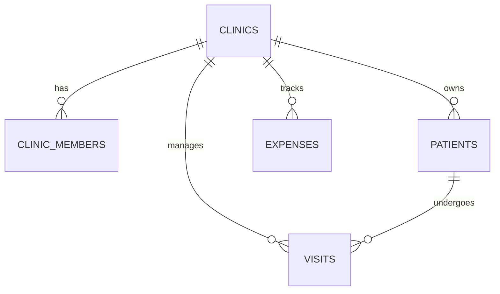

# IntelliDent

IntelliDent is a modern, multi-tenant Dental Patient Management Platform designed for clinics to manage records, treatments, financials, and AI-assisted clinical notes.

## 🚀 Getting Started

### Prerequisites
- Node.js (v18+)
- PostgreSQL (Neon recommended for cloud, PGlite used for local)

### Installation
1. **Clone & Install**:
   ```bash
   git clone https://github.com/HarshBhatia/Intellident.git
   cd intellident2
   npm install
   ```
2. **Environment**: Copy `.env.example` to `.env.local` in `apps/dashboard/` and add your Clerk keys.
3. **Run**: `npm run dev` (Starts Dashboard on `:3000`, Landing on `:3001`).
4. **Init DB**: Visit `http://localhost:3000/api/init` to setup local schema.

---

## 🏗️ Repository Architecture (Monorepo)

- **`apps/dashboard`**: Next.js 16 (App Router) - Main web interface and API.
- **`apps/mobile`**: Expo / React Native - Mobile patient access.
- **`packages/api`**: Shared database logic and PGlite/Neon connection wrapper.

### Tech Stack
- **Frontend**: React 19, Tailwind CSS v4, Recharts, Lucide Icons.
- **Backend**: Next.js API Routes (Serverless), Clerk Auth.
- **Database**: PostgreSQL (Neon/PGlite) using Raw SQL.
- **AI**: Google Gemini for audio-to-clinical-note conversion.

---

## 📊 Data Model & Multi-Tenancy

The system uses a **strict multi-tenant model** partitioned by `clinic_id`.



- **Clinics**: Top-level tenants.
- **Patients**: Basic identity and legacy clinical data.
- **Visits**: Individual consultation records (Normalized clinical data).
- **Financials**: Payments tracked in visits/patients; expenses tracked in `expenses`.

---

## 🛠️ Development Conventions

### 1. Database Interactions
- **Utility**: Always use `getDb()` from `@intellident/api`.
- **Syntax**: Use tagged template literals (`` sql`...` ``) for safety.
- **Isolation**: **MUST** filter every query by `clinic_id`.
  - `SELECT * FROM patients WHERE clinic_id = ${clinicId}`

### 2. Security & Auth
- **Middleware**: Gated by Clerk and `clinic_id` cookie requirement.
- **API Pattern**:
  1. Verify `auth().userId`.
  2. Verify `clinic_id` cookie exists.
  3. Call `verifyMembership(clinicId, userEmail)`.

### 3. Schema Management
- **Source of Truth**: `apps/dashboard/src/app/api/init/route.ts`.
- **Update Process**: Add SQL to `init/route.ts` and run the endpoint.

---

## 📝 License
This project is private and intended for specific clinic implementations.
